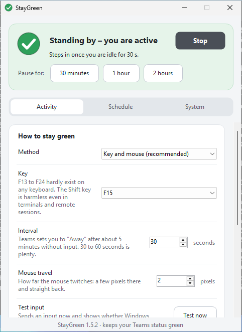

# StayGreen

**Keeps your Microsoft Teams status on "Available" while you are briefly away from your desk.**

A tiny Windows app: **one single file** (`StayGreen.exe`, about 140 KB), **no installation**, **no administrator rights**, **no network access**.

[**⬇ Download StayGreen.exe directly**](https://github.com/tho19b-oss/Staygreen/releases/latest/download/StayGreen.exe) · [all downloads](https://github.com/tho19b-oss/Staygreen/releases/latest) · [Deutsche Version](README.md)

---

## Ready in one minute

1. Download **`StayGreen.exe`** (link above) and double-click it. If a corporate web filter blocks EXE downloads, the [releases page](https://github.com/tho19b-oss/Staygreen/releases/latest) has the same file as `StayGreen-portable.zip`.
2. If Windows shows "Windows protected your PC" (SmartScreen): **More info → Run anyway**. The EXE is not code-signed, so Windows asks for every new, unknown file. Alternatively right-click the file → *Properties* → tick **Unblock** → *OK* beforehand.
3. Done. StayGreen starts right away, the lamp at the top of the window turns green and your status stays green. Click **Stop** to end it.

The first time, take a look at the **System** tab: there you choose whether StayGreen starts with Windows and keeps running in the notification area next to the clock.

> Windows 11 hides new icons in the notification area behind the `^` arrow. Drag the StayGreen icon out if you want to see it permanently.

## What it looks like

<p align="center">
  
</p>

*Captured on Windows 11. The lamp at the top shows the state: green = active, amber = waiting for the time window, red = input is being rejected, grey = stopped.*

## Features

| Feature | Description |
|---|---|
| **Keeps your status green** | Generates a tiny real input at an adjustable interval (5–600 s, default 30 s): the **F15** key (no keyboard has it, nothing reacts to it), a **mouse movement** of a few pixels there and straight back, or both. |
| **Smart mode** | Only acts while *you* are idle. While you work, StayGreen stays out of the way. |
| **Keep PC awake** | Prevents standby, screen saver and automatic locking due to inactivity. |
| **Schedule** | Only keep active in certain time windows, e.g. Mon–Fri 08:00–12:00 and 13:00–17:00. Several windows, any weekdays, also across midnight. Outside the windows StayGreen pauses and the PC may sleep. |
| **Auto-stop** | Stop daily at a time **or** once at a date, optionally with: **close Teams** (status changes to "Offline"), **lock Windows**, **shut down the computer** (60-second countdown, cancellable, programs are not closed by force) and **exit StayGreen**. Appointments the PC slept through are not made up for. |
| **Autostart** | Start with Windows, no admin rights (per-user autostart). |
| **Start automatically when opened** | A double-click is enough. |
| **Notification area (tray)** | Minimizing and closing park StayGreen next to the clock. The icon shows the state (green, amber, red, grey). |
| **Start minimized** | Tray icon only, no window. |
| **Log** | Writes start, stop, pauses and auto-stop with time and runtime to a text file (default `Documents\StayGreen-Protokoll.txt`). |
| **Global hotkey** | Start/stop with a key combination (default Ctrl+Alt+G, configurable). |
| **German & English** | Automatic by Windows language, switchable. |
| **Portable** | A file named `StayGreen.portable` next to the EXE keeps the settings there as well (e.g. for a USB stick). |
| **Single instance** | A second start brings the existing window to the front. |
| **Command line** | `--start`, `--no-start`, `--minimized`, `--tab <name>`, `--settings <file>`, `--lang de\|en`, `--selftest`, `--help`. |

Meant for Microsoft Teams (new and classic). The principle works with any program that evaluates the Windows idle time, for example Skype for Business, Slack, Zoom or Webex.

## How does it work?

Teams sets you to "Away" after about five minutes without keyboard or mouse activity. Windows itself provides the idle time. StayGreen resets that counter regularly through the Windows function `SendInput` and keeps the PC awake with `SetThreadExecutionState`. There is no connection to Teams, no sign-in, no Microsoft API: Teams simply sees a PC on which something is typed from time to time.

## Limits

- **Locked PC (Win+L):** Teams always shows "Away" while the PC is locked. No software can change that. StayGreen only prevents *automatic* locking due to inactivity.
- **Teams in the browser:** The browser tab has to be in the foreground, otherwise the input does not count there.
- **Calendar and calls:** States such as "In a meeting", "In a call" or "Do not disturb" come from Teams itself and stay untouched.
- **Windows only.** Developed and automatically tested for Windows 10 and 11. Older versions with .NET Framework 4.7.2 should work but are untested.

## Troubleshooting

**Does anything arrive at all?** Start `StayGreen.exe --selftest` (e.g. via a shortcut with that addition). StayGreen then checks on your computer whether Windows accepts key presses and mouse movements and resets the idle counter, whether the hotkey fires and whether autostart is writable, and shows the result in a window. The test only writes a result file to the temp folder and removes its short-lived test autostart entry again immediately.

**The status still turns to "Away".** On the *Activity* tab click **Test now**. If StayGreen reports success, the input reaches Windows. Then the method **Key and mouse**, a shorter interval (30 s) or switching off smart mode usually helps. If the status card says "Input is being rejected", Windows blocks the input (locked session, disconnected remote session or security software).

**Windows or the virus scanner blocks the file.** The EXE is unsigned and new, so SmartScreen and some scanners warn. You can verify the hash in `SHA256SUMS.txt` (attached to every release) or build the EXE from source (see below). If a company policy (e.g. AppLocker) blocks unsigned programs from the download folder, you need to talk to your IT department.

**Autostart cannot be switched on.** A policy forbids writing the autostart entry. StayGreen tells you and keeps the switch off.

**Reset everything.** Exit StayGreen and delete the folder `%APPDATA%\StayGreen`. Switch autostart off on the *System* tab beforehand (this removes the entry under `HKCU\Software\Microsoft\Windows\CurrentVersion\Run`). StayGreen leaves nothing else behind.

## Privacy and security

- No network access, no telemetry, no background updates.
- Runs without administrator rights and only writes to `%APPDATA%\StayGreen`, to the log file (if enabled) and to the per-user autostart (if enabled).
- The complete source code is in this repository. Release files are built exclusively in GitHub Actions from the published source.

## Note on use at work

StayGreen simulates input on *your own* computer. Whether that is allowed at your workplace is governed by your employer's IT and workplace policies. Check beforehand and only use it where it is permitted.

StayGreen is an independent open-source project and not affiliated with Microsoft. "Microsoft Teams" is a trademark of Microsoft. The idea is inspired by tools such as "Status Holder"; the code is an entirely original implementation.

## Build and develop

Requirement: [.NET SDK 8](https://dotnet.microsoft.com/download) (on Windows, Linux or macOS).

```text
dotnet test  tests/StayGreen.Tests -c Release                 # unit tests of the core logic
dotnet build src/StayGreen/StayGreen.csproj -c Release        # produces bin/Release/net472/StayGreen.exe
```

The EXE targets **.NET Framework 4.7.2**, which is built into Windows 10 (1803+) and Windows 11. That is why it needs no runtime installation and stays a single file.

```text
src/StayGreen/
  Core/       Platform-neutral logic: schedule, auto-stop, settings, engine, texts (tested)
  Platform/   Windows layer: SendInput, idle time, keep-awake, hotkey, autostart, self-test
  UI/         User interface (WinForms): main window, tabs, tray, countdown
tests/        xUnit tests (run on Linux and Windows)
tools/        make_icon.py generates the icon without third-party dependencies
.github/      CI: tests, Windows build, self-test, start test, release
```

**Update screenshots:** *Actions → Screenshots → Run workflow* with *commit* ticked. The workflow starts the EXE on Windows and stores the images under `docs/images/`.

**Publish a release:** in GitHub go to *Actions → CI → Run workflow* and tick *release* (or push a tag such as `v1.0.0`). The version lives in `src/StayGreen/StayGreen.csproj` (`<Version>`).

## License

[MIT](LICENSE)
