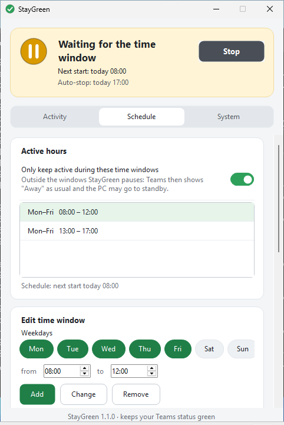

# StayGreen

**Keeps your Microsoft Teams status on "Available" while you are briefly away from your desk.**

A tiny Windows app: **one single file** (`StayGreen.exe`, about 220 KB), **no installation**, **no administrator rights**, **no network access**.

[**⬇ Download StayGreen.exe directly**](https://github.com/tho19b-oss/Staygreen/releases/latest/download/StayGreen.exe) · [all downloads](https://github.com/tho19b-oss/Staygreen/releases/latest) · [Deutsche Version](README.md)

---

## Ready in one minute

1. Download **`StayGreen.exe`** (link above) and double-click it. If a corporate web filter blocks EXE downloads, the [releases page](https://github.com/tho19b-oss/Staygreen/releases/latest) has the same file as `StayGreen-portable.zip`.
2. If Windows shows "Windows protected your PC" (SmartScreen): **More info → Run anyway**. The EXE is not code-signed, so Windows asks for every new, unknown file. Alternatively right-click the file → *Properties* → tick **Unblock** → *OK* beforehand. You can verify where the file comes from, see [Privacy and security](#privacy-and-security).
3. Done. StayGreen starts right away, the lamp at the top of the window turns green and your status stays green. Click **Stop** to end it. The very first time you open the window, a short notice on how to use it appears once (see below).

The first time, take a look at the **System** tab: there you choose whether StayGreen starts with Windows and keeps running in the notification area next to the clock.

**With a package manager:** From version 1.2.0 on, every release comes with a Scoop manifest:

```text
scoop install https://github.com/tho19b-oss/Staygreen/releases/latest/download/staygreen.json
```

Scoop also puts the command `StayGreen` on your path, so `StayGreen --toggle` or `StayGreen --pause 30` work in any console. Ready-made winget manifests are attached as well (`StayGreen-winget-manifests.zip`); submitting them to the winget repository is still pending.

> Windows 11 hides new icons in the notification area behind the `^` arrow. Drag the StayGreen icon out if you want to see it permanently.

## What it looks like

<p align="center">
  
  
</p>

*Captured on Windows 11. The status card at the top shows the state and changes its tint accordingly: green = active, amber = waiting (for the time window or for Teams) or paused, red = input is being rejected, grey = stopped. There is also a dark appearance, see the [German screenshots](README.md#so-sieht-es-aus).*

## Features

| Feature | Description |
|---|---|
| **Keeps your status green** | Generates a tiny real input at an adjustable interval (5–600 s, default 30 s): a **key press** (default **F15**; F13 to F24 or the Shift key are selectable), a **mouse movement** of a few pixels there and straight back, or both. F13 to F24 hardly exist on any keyboard, but some programs (terminals, macro tools) react to them anyway; the Shift key is harmless even there. From 4 minutes between inputs the window warns you, because Teams shows "Away" after about 5 minutes. |
| **Smart mode** | Only acts while *you* are idle. While you work, StayGreen stays out of the way. |
| **Keep PC awake** | Prevents standby, screen saver and automatic locking due to inactivity. **Your PC therefore stays unlocked when you walk away.** Lock it yourself (Win+L) when you are away for longer. |
| **Teams only** | Optional: only hold while Teams is running. While Teams is closed, StayGreen waits and the PC may sleep. |
| **Safety net** | Optional: stop automatically once holding has been running for that many hours in a row (in case you forget to switch it off). |
| **Pause** | Stops StayGreen for 15 minutes up to 2 hours and carries on by itself. From the notification-area icon, the buttons on the *Activity* tab or `--pause`. |
| **Schedule** | On the *Schedule* tab: Only keep active in certain time windows, e.g. Mon–Fri 08:00–12:00 and 13:00–17:00. Several windows, any weekdays, also across midnight. Outside the windows StayGreen pauses and the PC may sleep. |
| **Vacation and holidays** | On the *Schedule* tab: days or periods on which no window begins. The notification-area menu also has **Skip today**. StayGreen tidies up past periods itself. |
| **Auto-stop** | On the *Schedule* tab, section "End of day": **daily** at a time, **once** at a date, or **at the end of the schedule** (end of the last window of a day; breaks shorter than 3 hours such as lunch do not count). Optionally with: **close Teams** (status changes to "Offline", a running call is ended), **lock Windows**, **shut down the computer** (programs are not closed by force) and **exit StayGreen**. |
| **Warning** | Before "close Teams", "lock" and "shut down" a countdown appears (default 60 s) in which you can **cancel**, **postpone by 15 minutes** or **run now**. Focus starts on "Cancel", so an accidental key press triggers nothing. Appointments the PC slept through are not made up for. |
| **Autostart** | Start with Windows, no admin rights (per-user autostart). |
| **Start automatically when opened** | A double-click is enough. |
| **Notification area (tray)** | Minimizing and closing park StayGreen next to the clock. The icon shows the state (green, amber, red, grey). Left click opens the window, **middle click starts/stops**. The menu offers start/stop, pause, resume, skip today and exit. |
| **Start minimized** | Tray icon only, no window. |
| **Log** | Writes start, stop, pauses, auto-stop and also **lock/unlock, rejected input and standby** with time to a text file (default: `StayGreen-Protokoll.txt` in the settings folder). That makes it possible to see why your status flipped in between. From 1 MB StayGreen keeps one backup (`….txt.1`). |
| **Global hotkey** | Start/stop with a key combination (default Ctrl+Alt+G, configurable: A–Z and F1–F24). Combinations that would type a character on your keyboard (Ctrl+Alt is AltGr on many keyboards, e.g. Ctrl+Alt+Q = "@" on the German one) are not registered; StayGreen explains why instead. |
| **Appearance** | Light, dark or automatic by Windows; the Windows high-contrast mode is respected. All controls have names for screen readers. |
| **German & English** | Automatic by Windows language, switchable. |
| **Portable** | A file named `StayGreen.portable` next to the EXE keeps the settings there as well (e.g. for a USB stick). |
| **Single instance and commands** | A second start brings the existing window to the front. With a command (`--start`, `--stop`, `--toggle`, `--pause`, `--resume`) it controls the running instance instead, e.g. from a shortcut, the Task Scheduler or a Stream Deck. The channel only works for your user account in this Windows session. |
| **Command line** | `--start`, `--stop`, `--toggle`, `--pause [minutes]`, `--resume`, `--no-start`, `--minimized`, `--tab <name>` (`activity`, `schedule`, `system`), `--settings <file>`, `--lang de\|en`, `--theme light\|dark\|auto`, `--selftest`, `--help`. |

Meant for Microsoft Teams (new and classic). The principle works with any program that evaluates the Windows idle time, for example Skype for Business, Slack, Zoom or Webex.

## How does it work?

Teams sets you to "Away" after about five minutes without keyboard or mouse activity. Windows itself provides the idle time. StayGreen resets that counter regularly through the Windows function `SendInput` and keeps the PC awake with `SetThreadExecutionState`. There is no connection to Teams, no sign-in, no Microsoft API: Teams simply sees a PC on which something is typed from time to time.

## Limits

- **Locked PC (Win+L):** Teams always shows "Away" while the PC is locked. No software can change that. StayGreen only prevents *automatic* locking due to inactivity.
- **Teams in the browser:** The browser tab has to be in the foreground, otherwise the input does not count there.
- **Calendar and calls:** States such as "In a meeting", "In a call" or "Do not disturb" come from Teams itself and stay untouched.
- **Windows only.** Developed and automatically tested for Windows 10 and 11. Older versions with .NET Framework 4.7.2 should work but are untested.

## Troubleshooting

**Does anything arrive at all?** Start `StayGreen.exe --selftest` (e.g. via a shortcut with that addition). StayGreen then checks on your computer whether Windows accepts key presses and mouse movements and resets the idle counter, whether the hotkey fires, whether the command channel works and whether autostart is writable, and shows the result in a window. The test only writes a result file to the temp folder and removes its short-lived test autostart entry again immediately.

**The status still turns to "Away".** On the *Activity* tab click **Test now**. If StayGreen reports "Test passed", Windows accepted the input and reset the idle counter, so it reaches Windows. Then the method **Key and mouse**, a shorter interval (30 s) or switching off smart mode usually helps. If it says "Test failed", Windows either rejects the input or does not count it as activity; try another method or key. If the status card at the top says "Input is being rejected", Windows blocks the input (locked session, disconnected remote session or security software). The **log** shows when that happened.

**Strange characters appear in a terminal or remote session.** On the *Activity* tab set the **key** to "Shift key" or use only the method **Mouse movement**.

**Windows or the virus scanner blocks the file.** The EXE is unsigned and new, so SmartScreen and some scanners warn. You can verify the hash in `SHA256SUMS.txt` (attached to every release) or build the EXE from source (see below). If a company policy (e.g. AppLocker) blocks unsigned programs from the download folder, you need to talk to your IT department. How a signature would be set up is described in [docs/SIGNING.md](docs/SIGNING.md) (German).

**Autostart cannot be switched on.** A policy forbids writing the autostart entry. StayGreen tells you and keeps the switch off.

**Settings or log are not saved.** If StayGreen cannot write a file (read-only folder, invalid path), a notice appears once, and on the *System* tab the reason is shown in red at the affected setting.

**An error in the program.** Errors that StayGreen catches so that holding keeps running end up in `error.log` in the settings folder (*System* tab → *Settings folder* → Open). The same message is only counted, not written out every time; the file stays under 256 KB. Attaching it to a bug report helps a lot.

**Reset everything.** Exit StayGreen and delete the folder `%APPDATA%\StayGreen`. Switch autostart off on the *System* tab beforehand (this removes the entry under `HKCU\Software\Microsoft\Windows\CurrentVersion\Run`). StayGreen leaves nothing else behind.

## Privacy and security

- StayGreen itself **never opens a network connection**: no telemetry, no background updates. "New version" on the *System* tab only opens the release page in your browser.
- Runs without administrator rights and only writes to the settings folder (`%APPDATA%\StayGreen`, including log and `error.log`), to a log file you chose yourself (if enabled) and to the per-user autostart (if enabled). A log you created earlier in the "Documents" folder stays there; new logs deliberately do not go to "Documents" because that folder is synced to the cloud on many PCs.
- The command channel between two starts is a local pipe that only your own user account in the current Windows session can talk to.
- The complete source code is in this repository. Release files are built exclusively in GitHub Actions from the published source. An existing release is not silently overwritten.
- **Verify the origin:** besides the checksums in `SHA256SUMS.txt`, CI creates a provenance attestation from version 1.2.0 on. You can check it with the [GitHub CLI](https://cli.github.com/):

  ```text
  gh attestation verify StayGreen.exe -R tho19b-oss/Staygreen
  ```

## Note on use at work

StayGreen simulates input on *your own* computer and, while doing so, prevents standby and automatic locking; your PC stays unlocked when you walk away. Whether that is allowed at your workplace is governed by your employer's IT and workplace policies. Check beforehand and only use it where it is permitted. StayGreen itself points this out once when you first open the window.

StayGreen is an independent open-source project and not affiliated with Microsoft. "Microsoft Teams" is a trademark of Microsoft. The idea is inspired by tools such as "Status Holder"; the code is an entirely original implementation.

## Build and develop

Requirement: [.NET SDK 8](https://dotnet.microsoft.com/download) (on Windows, Linux or macOS).

```text
dotnet test  tests/StayGreen.Tests -c Release                 # unit tests of the core logic
dotnet build src/StayGreen/StayGreen.csproj -c Release        # produces bin/Release/net472/StayGreen.exe
```

The EXE targets **.NET Framework 4.7.2**, which is built into Windows 10 (1803+) and Windows 11. That is why it needs no runtime installation and stays a single file. The SDK's static analysis runs at the recommended level; the current state has no warnings.

```text
src/StayGreen/
  Core/       Platform-neutral logic: schedule, auto-stop (coordinator), settings, engine, logs, texts (tested)
  Platform/   Windows layer: SendInput, idle time, keep-awake, hotkey, command channel, autostart, self-test
  UI/         User interface (WinForms): main window, cards and switches, tray, warning, themes
tests/        xUnit tests (run on Linux and Windows)
tools/        make_icon.py generates the icon, make_manifests.py the Scoop and winget manifests
.github/      CI: tests, Windows build, self-test, start test (window, commands, log), release, Dependabot
docs/         Images for the README and the guide to signing (German)
```

**Update screenshots:** *Actions → Screenshots → Run workflow* with *commit* ticked. The workflow starts the EXE on Windows and stores the images under `docs/images/`. With *extra* it also produces scrolled check images of the lower card areas (meant as an artifact only) and a list in the log of all input fields with their screen-reader name and their value after scrolling.

**Publish a release:** in GitHub go to *Actions → CI → Run workflow* and tick *release* (or push a tag such as `v1.2.0`). The version lives in `src/StayGreen/StayGreen.csproj` (`<Version>`); a pushed tag has to match it. If the release already exists the run aborts: raise the version (recommended) or explicitly choose *overwrite*. The release contains the EXE, the portable ZIP, the checksums, the Scoop manifest and the winget manifests.

## License

[MIT](LICENSE)
