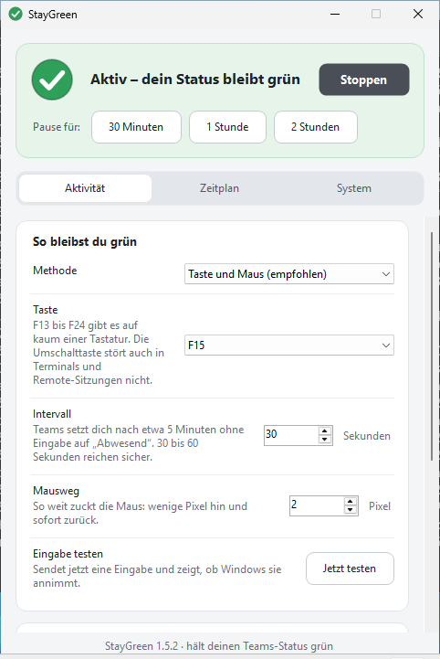
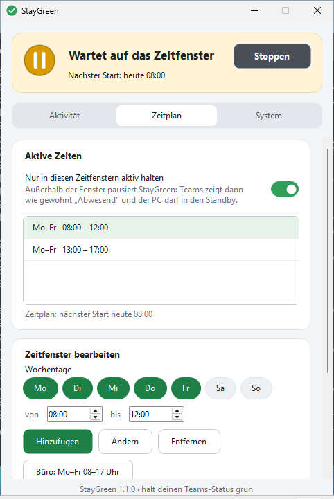
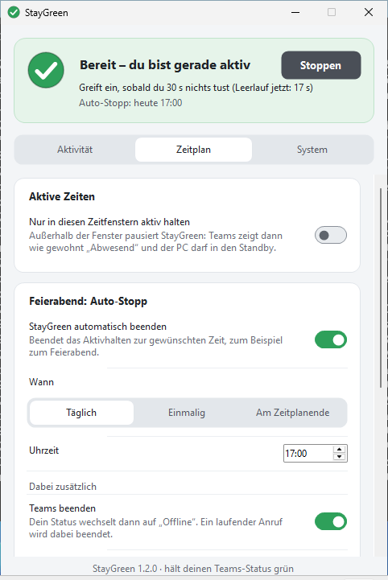
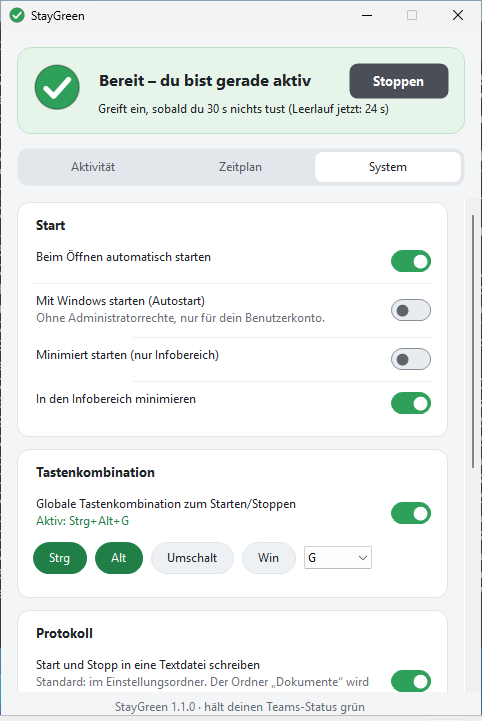
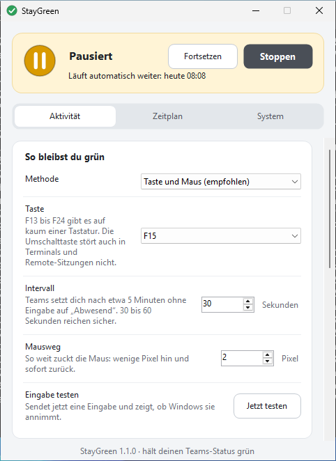
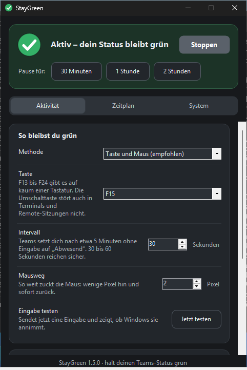

# StayGreen

**Hält deinen Microsoft-Teams-Status auf „Verfügbar“, wenn du mal kurz nicht am Platz bist.**

Eine winzige Windows-App: **eine einzige Datei** (`StayGreen.exe`, rund 220 KB), **ohne Installation**, **ohne Administratorrechte**, **ohne Netzwerkzugriff**.

[**⬇ StayGreen.exe direkt herunterladen**](https://github.com/tho19b-oss/Staygreen/releases/latest/download/StayGreen.exe) · [alle Downloads](https://github.com/tho19b-oss/Staygreen/releases/latest) · [English version](README.en.md)

---

## In einer Minute startklar

1. **`StayGreen.exe`** herunterladen (Link oben) und doppelklicken. Blockiert der Firmen-Webfilter den Download einer EXE, gibt es auf der [Release-Seite](https://github.com/tho19b-oss/Staygreen/releases/latest) dieselbe Datei als `StayGreen-portable.zip`.
2. Zeigt Windows „Der Computer wurde durch Windows geschützt“ (SmartScreen)? Dann **Weitere Informationen → Trotzdem ausführen**. Die EXE ist nicht digital signiert, deshalb fragt Windows bei jeder neuen, unbekannten Datei nach. Alternativ vorab per Rechtsklick auf die Datei → *Eigenschaften* → Haken bei **Zulassen** → *OK*. Die Herkunft lässt sich prüfen, siehe [Datenschutz und Sicherheit](#datenschutz-und-sicherheit).
3. Fertig. StayGreen startet sofort, die Lampe oben im Fenster wird grün, und dein Status bleibt grün. Mit **Stoppen** hörst du wieder auf. Beim allerersten Öffnen erscheint einmal ein Hinweis zur Nutzung (siehe unten).

Beim ersten Mal lohnt ein Blick auf den Reiter **System**: Dort stellst du ein, ob StayGreen mit Windows starten und im Infobereich neben der Uhr weiterlaufen soll.

**Per Paketmanager:** Ab Version 1.2.0 liegt jedem Release ein Scoop-Manifest bei:

```text
scoop install https://github.com/tho19b-oss/Staygreen/releases/latest/download/staygreen.json
```

Scoop legt außerdem den Befehl `StayGreen` in den Pfad. Damit gehen `StayGreen --toggle` oder `StayGreen --pause 30` in jeder Konsole. Für winget liegen fertig ausgefüllte Manifeste bei (`StayGreen-winget-manifests.zip`); die Aufnahme ins winget-Verzeichnis steht noch aus.

> Windows 11 versteckt neue Symbole im Infobereich hinter dem Pfeil `^`. Ziehe das StayGreen-Symbol heraus, wenn du es dauerhaft sehen willst.

## So sieht es aus

<p align="center">
  
  
</p>
<p align="center">
  
  
</p>
<p align="center">
  
  
</p>

*Aufnahmen auf Windows 11. Die Statuskarte oben zeigt den Zustand an und färbt sich passend ein: grün = aktiv, gelb = wartet (auf das Zeitfenster oder auf Teams) oder pausiert, rot = Eingaben werden abgelehnt, grau = gestoppt.*

## Funktionen

| Funktion | Beschreibung |
|---|---|
| **Status grün halten** | Erzeugt in einstellbaren Abständen (5–600 s, Standard 30 s) eine winzige echte Eingabe: einen **Tastendruck** (Standard **F15**; wählbar sind F13 bis F24 oder die Umschalttaste), eine **Mausbewegung** von wenigen Pixeln hin und sofort zurück, oder beides. F13 bis F24 gibt es auf kaum einer Tastatur; manche Programme (Terminals, Makro-Werkzeuge) reagieren trotzdem darauf. Die Umschalttaste stört auch dort nicht. Ab 4 Minuten Abstand warnt die Oberfläche, weil Teams nach etwa 5 Minuten „Abwesend“ anzeigt. |
| **Intelligenter Modus** | Greift nur ein, wenn *du* gerade nichts tust. Solange du arbeitest, bleibt StayGreen im Hintergrund. |
| **PC wach halten** | Verhindert Standby, Bildschirmschoner und das automatische Sperren durch Inaktivität. **Dein PC bleibt dadurch entsperrt, wenn du weggehst.** Sperre ihn bei längerer Abwesenheit selbst (Win+L). |
| **Nur mit Teams** | Optional: Nur aktiv halten, solange Teams läuft. Ist Teams beendet, wartet StayGreen und der PC darf schlafen. |
| **Sicherheitsnetz** | Optional: automatisch stoppen, wenn das Aktivhalten so viele Stunden am Stück gelaufen ist (falls du vergisst, es auszuschalten). |
| **Pause** | Hält StayGreen für 15 Minuten bis 2 Stunden an und macht danach von selbst weiter. Über die Knöpfe in der Statuskarte oben im Fenster (solange StayGreen aktiv hält), das Symbol im Infobereich oder `--pause`. |
| **Zeitplan** | Im Reiter *Zeitplan*: Nur in bestimmten Zeitfenstern aktiv halten, z. B. Mo–Fr 08:00–12:00 und 13:00–17:00. Mehrere Fenster, beliebige Wochentage, auch über Mitternacht (22:00–06:00). Außerhalb pausiert StayGreen und der PC darf schlafen. |
| **Urlaub und Feiertage** | Im Reiter *Zeitplan*: Tage oder Zeiträume, an denen kein Fenster beginnt. Im Infobereich-Menü gibt es außerdem **Heute aussetzen**. Vergangene Zeiträume räumt StayGreen selbst auf. |
| **Auto-Stopp** | Im Reiter *Zeitplan*, Abschnitt „Feierabend“: **täglich** zu einer Uhrzeit, **einmalig** an einem Datum oder **am Zeitplanende** (Ende des letzten Fensters eines Tages; Pausen unter 3 Stunden wie die Mittagspause zählen nicht). Optional mit: **Teams beenden** (Status wechselt auf „Offline“, ein laufender Anruf wird beendet), **Windows sperren**, **Computer herunterfahren** (ohne Zwangsbeenden von Programmen) und **StayGreen beenden**. |
| **Vorwarnung** | Vor „Teams beenden“, „Sperren“ und „Herunterfahren“ erscheint ein Countdown (Standard 60 s), in dem du **abbrechen**, **um 15 Minuten verschieben** oder **sofort ausführen** kannst. Der Fokus liegt auf „Abbrechen“, ein versehentlicher Tastendruck löst also nichts aus. Termine, die der PC verschlafen hat (Standby), werden nicht nachgeholt. |
| **Autostart** | Mit Windows starten, ohne Administratorrechte (Benutzer-Autostart). |
| **Beim Öffnen automatisch starten** | Doppelklick genügt, kein zusätzlicher Klick auf „Starten“. |
| **Infobereich (Tray)** | Minimieren und Schließen legen StayGreen neben die Uhr. Das Symbol zeigt den Zustand (grün, gelb, rot, grau). Linksklick öffnet das Fenster, **Mittelklick startet/stoppt**. Das Menü bietet Starten/Stoppen, Pausieren, Fortsetzen, Heute aussetzen und Beenden. |
| **Minimiert starten** | Nur Symbol im Infobereich, kein Fenster. |
| **Protokoll** | Schreibt Start, Stopp, Pausen, Auto-Stopp sowie **Sperren/Entsperren, blockierte Eingaben und Standby** mit Uhrzeit in eine Textdatei (Standard: `StayGreen-Protokoll.txt` im Einstellungsordner). Damit lässt sich nachvollziehen, warum der Status zwischendurch gekippt ist. Ab 1 MB legt StayGreen eine Sicherung an (`….txt.1`). |
| **Globaler Hotkey** | Starten/Stoppen per Tastenkombination (Standard Strg+Alt+G, frei wählbar: A–Z und F1–F24). Kombinationen, die auf deiner Tastatur ein Zeichen tippen würden (Strg+Alt ist auf vielen Tastaturen AltGr, auf der deutschen z. B. Strg+Alt+Q = „@“), meldet StayGreen nicht an, sondern erklärt es. |
| **Darstellung** | Hell, Dunkel oder automatisch nach Windows; das Kontrastdesign von Windows wird berücksichtigt. Alle Bedienelemente haben Namen für Screenreader. |
| **Deutsch & Englisch** | Automatisch nach Windows-Sprache, umschaltbar. |
| **Portabel** | Eine Datei `StayGreen.portable` neben der EXE → Einstellungen liegen ebenfalls dort (z. B. für USB-Stick). |
| **Einzelinstanz und Befehle** | Ein zweiter Start holt das vorhandene Fenster nach vorn. Mit einem Befehl (`--start`, `--stop`, `--toggle`, `--pause`, `--resume`) steuert er stattdessen die laufende Instanz, z. B. aus einer Verknüpfung, der Aufgabenplanung oder einem Stream Deck. Der Kanal gilt nur für dein Benutzerkonto in dieser Windows-Sitzung. |
| **Kommandozeile** | `--start`, `--stop`, `--toggle`, `--pause [Minuten]`, `--resume`, `--no-start`, `--minimized`, `--tab <Name>` (`activity`, `schedule`, `system`), `--settings <Datei>`, `--lang de\|en`, `--theme light\|dark\|auto`, `--selftest`, `--help`. |

Gedacht für Microsoft Teams (neu und klassisch). Das Prinzip greift bei allen Programmen, die die Leerlaufzeit von Windows auswerten, zum Beispiel Skype for Business, Slack, Zoom oder Webex.

## Wie funktioniert das?

Teams setzt dich nach etwa fünf Minuten ohne Tastatur- und Mausaktivität auf „Abwesend“. Die Leerlaufzeit liefert Windows selbst. StayGreen setzt diesen Zähler über die Windows-Funktion `SendInput` regelmäßig zurück und hält den PC mit `SetThreadExecutionState` wach. Es gibt keine Verbindung zu Teams, keine Anmeldung, keine Schnittstelle zu Microsoft: Teams sieht schlicht einen PC, an dem regelmäßig etwas eingegeben wird.

## Grenzen

- **Gesperrter PC (Win+L):** Beim Sperren zeigt Teams immer „Abwesend“. Dagegen hilft keine Software. StayGreen verhindert nur das *automatische* Sperren durch Inaktivität.
- **Teams im Browser:** Der Browser-Tab muss im Vordergrund sein, sonst zählt die Eingabe dort nicht.
- **Kalender und Anrufe:** Zustände wie „In einer Besprechung“, „Im Anruf“ oder „Nicht stören“ kommen von Teams selbst und bleiben unberührt.
- **Nur Windows.** Entwickelt und automatisch getestet für Windows 10 und 11. Ältere Versionen mit .NET Framework 4.7.2 sollten laufen, sind aber nicht getestet.

## Fehlersuche

**Kommt überhaupt etwas an?**
`StayGreen.exe --selftest` starten (z. B. über eine Verknüpfung mit diesem Zusatz). StayGreen prüft dann auf deinem Rechner, ob Windows Tastendruck und Mausbewegung annimmt und den Leerlaufzähler zurücksetzt, ob der Hotkey auslöst, ob der Befehlskanal funktioniert und ob der Autostart schreibbar ist, und zeigt das Ergebnis in einem Fenster. Der Test schreibt nur eine Ergebnisdatei in den Temp-Ordner und entfernt seinen kurzzeitigen Test-Eintrag im Autostart sofort wieder.

**Der Status wird trotzdem „Abwesend“.**
Im Reiter *Aktivität* auf **Jetzt testen** klicken. Meldet StayGreen „Test bestanden“, hat Windows die Eingabe angenommen und den Leerlaufzähler zurückgesetzt, sie kommt also an. Dann hilft meist die Methode **Taste und Maus**, ein kürzeres Intervall (30 s) oder das Abschalten des intelligenten Modus. Heißt es „Test fehlgeschlagen“, lehnt Windows die Eingabe ab oder wertet sie nicht als Aktivität; dann hilft eine andere Methode oder Taste. Zeigt die Statuskarte oben „Eingaben werden abgelehnt“, blockiert Windows die Eingabe (gesperrte Sitzung, getrennte Remote-Sitzung oder Sicherheitssoftware). Das **Protokoll** zeigt, wann das passiert ist.

**In einem Terminal oder einer Remote-Sitzung erscheinen seltsame Zeichen.**
Stelle im Reiter *Aktivität* die **Taste** auf „Umschalttaste“ oder nutze nur die Methode **Mausbewegung**.

**Windows oder der Virenscanner blockiert die Datei.**
Die EXE ist nicht signiert und neu, deshalb warnen SmartScreen und manche Scanner. Du kannst den Hash in `SHA256SUMS.txt` (liegt bei jedem Release) prüfen oder die EXE aus dem Quelltext selbst bauen (siehe unten). Blockiert eine Firmenrichtlinie (z. B. AppLocker) das Ausführen unsignierter Programme aus dem Download-Ordner, bleibt nur die Rücksprache mit der IT. Wie eine Signatur eingerichtet würde, steht in [docs/SIGNING.md](docs/SIGNING.md).

**Autostart lässt sich nicht einschalten.**
Eine Richtlinie verbietet dann das Schreiben des Autostart-Eintrags. StayGreen meldet das und lässt den Schalter aus.

**Einstellungen oder Protokoll werden nicht gespeichert.**
Kann StayGreen eine Datei nicht schreiben (Ordner schreibgeschützt, Pfad ungültig), erscheint einmal ein Hinweis, und im Reiter *System* steht der Grund in Rot an der betroffenen Einstellung.

**Ein Fehler im Programm.**
Fehler, die StayGreen abfängt, damit das Aktivhalten weiterläuft, landen in `error.log` im Einstellungsordner (Reiter *System* → *Einstellungsordner* → Öffnen). Dieselbe Meldung wird nur gezählt, nicht jedes Mal ausgeschrieben; die Datei bleibt unter 256 KB. Hängst du sie an eine Fehlermeldung an, hilft das sehr.

**Alles zurücksetzen.**
StayGreen beenden, den Ordner `%APPDATA%\StayGreen` löschen. Den Autostart vorher im Reiter *System* ausschalten (dabei wird der Eintrag unter `HKCU\Software\Microsoft\Windows\CurrentVersion\Run` entfernt). Mehr hinterlässt StayGreen nicht.

## Datenschutz und Sicherheit

- StayGreen selbst baut **nie eine Netzwerkverbindung** auf: keine Telemetrie, keine Updates im Hintergrund. „Neue Version suchen“ im Reiter *System* öffnet nur die Release-Seite in deinem Browser.
- Läuft ohne Administratorrechte und schreibt nur in den Einstellungsordner (`%APPDATA%\StayGreen`, inklusive Protokoll und `error.log`), in eine selbst gewählte Protokolldatei (wenn aktiviert) und in den Benutzer-Autostart (wenn aktiviert). Ein Protokoll, das du früher im Ordner „Dokumente“ angelegt hast, bleibt dort; neue Protokolle liegen bewusst nicht in „Dokumente“, weil der Ordner auf vielen PCs in die Cloud synchronisiert wird.
- Der Befehlskanal zwischen zwei Starts ist eine lokale Pipe, die nur dein eigenes Benutzerkonto in der aktuellen Windows-Sitzung ansprechen kann.
- Der gesamte Quelltext liegt in diesem Repository. Release-Dateien entstehen ausschließlich in GitHub Actions aus dem veröffentlichten Quelltext. Ein vorhandenes Release wird nicht still überschrieben.
- **Herkunft prüfen:** Neben den Prüfsummen in `SHA256SUMS.txt` erstellt die CI ab Version 1.2.0 einen Herkunftsnachweis. Mit der [GitHub-CLI](https://cli.github.com/) lässt er sich prüfen:

  ```text
  gh attestation verify StayGreen.exe -R tho19b-oss/Staygreen
  ```

## Hinweis zur Nutzung am Arbeitsplatz

StayGreen simuliert Eingaben auf *deinem eigenen* Rechner und verhindert dabei Standby sowie das automatische Sperren; dein PC bleibt entsperrt, wenn du weggehst. Ob das am Arbeitsplatz erlaubt ist, regeln die IT- und Arbeitsplatz-Richtlinien deines Arbeitgebers. Informiere dich vorher und nutze es nur, wo es zulässig ist. Beim ersten Öffnen weist StayGreen einmal selbst darauf hin.

StayGreen ist ein unabhängiges Open-Source-Projekt und steht in keiner Verbindung zu Microsoft. „Microsoft Teams“ ist eine Marke von Microsoft. Die Idee ist von Werkzeugen wie „Status Holder“ inspiriert, der Code ist eine vollständige Eigenentwicklung.

## Selbst bauen und entwickeln

Voraussetzung: [.NET SDK 8](https://dotnet.microsoft.com/download) (auf Windows, Linux oder macOS).

```text
dotnet test  tests/StayGreen.Tests -c Release                 # Unit-Tests der Kernlogik
dotnet build src/StayGreen/StayGreen.csproj -c Release        # erzeugt bin/Release/net472/StayGreen.exe
```

Die EXE zielt auf **.NET Framework 4.7.2**, das in Windows 10 (ab 1803) und Windows 11 fest eingebaut ist. Deshalb braucht sie keine Laufzeit-Installation und bleibt eine einzelne Datei. Die statische Analyse des SDK läuft im empfohlenen Umfang mit; der Stand ist warnungsfrei.

```text
src/StayGreen/
  Core/       Plattformneutrale Logik: Zeitplan, Auto-Stopp (Koordinator), Einstellungen, Engine, Protokolle, Texte (getestet)
  Platform/   Windows-Schicht: SendInput, Leerlaufzeit, Wach-Halten, Hotkey, Befehlskanal, Autostart, Selbsttest
  UI/         Oberfläche (WinForms): Hauptfenster, Karten und Schalter, Tray, Vorwarnung, Themes
tests/        xUnit-Tests (laufen auf Linux und Windows)
tools/        make_icon.py erzeugt das Icon, make_manifests.py die Scoop- und winget-Manifeste
.github/      CI: Tests, Windows-Build, Selbsttest, Start-Test (Fenster, Befehle, Protokoll), Release, Dependabot
docs/         Bilder für die README und die Anleitung zum Signieren
```

**Screenshots aktualisieren:** *Actions → Screenshots → Run workflow* mit Haken bei *commit*. Der Workflow startet die EXE auf Windows und legt die Bilder unter `docs/images/` ab. Mit *extra* entstehen zusätzlich gescrollte Prüfbilder der unteren Kartenbereiche (nur als Artefakt gedacht) und im Protokoll eine Liste aller Eingabefelder mit ihrem Namen für Screenreader und ihrem Wert nach dem Scrollen.

**Release veröffentlichen:** In GitHub unter *Actions → CI → Run workflow* die Option *Release* anhaken (oder ein Tag `v1.2.0` pushen). Die Version steht in `src/StayGreen/StayGreen.csproj` (`<Version>`); ein gepushter Tag muss dazu passen. Existiert das Release schon, bricht der Lauf ab: Erhöhe die Version (empfohlen) oder wähle ausdrücklich *overwrite*. Das Release enthält die EXE, das portable ZIP, die Prüfsummen, das Scoop-Manifest und die winget-Manifeste.

## Lizenz

[MIT](LICENSE)
